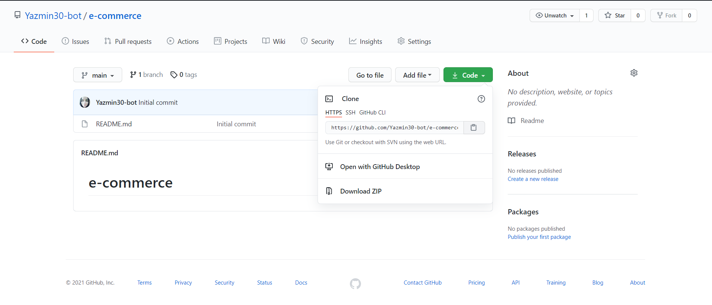
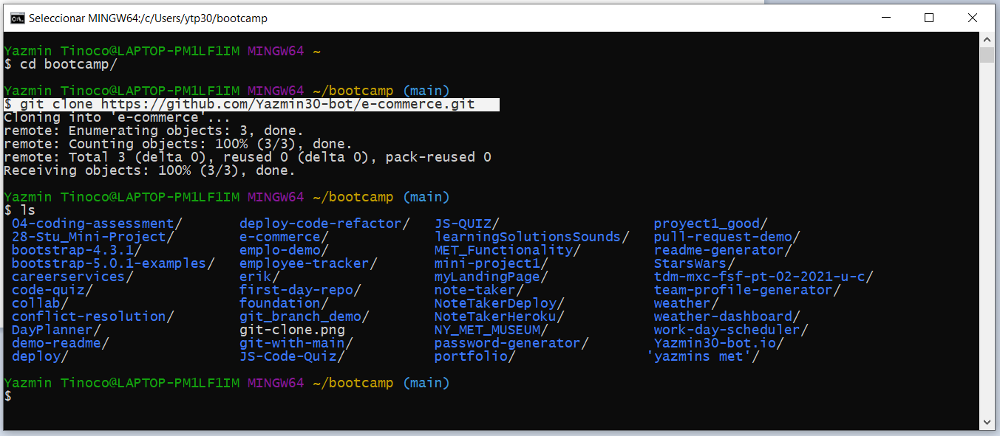
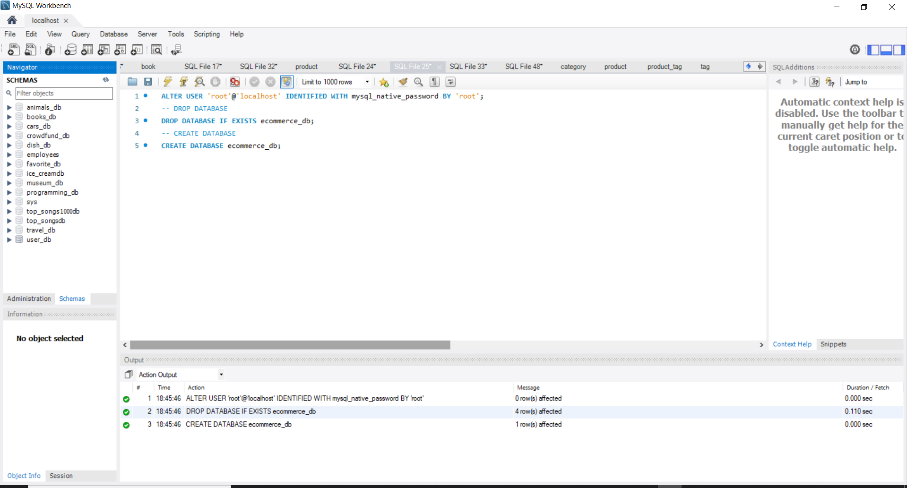
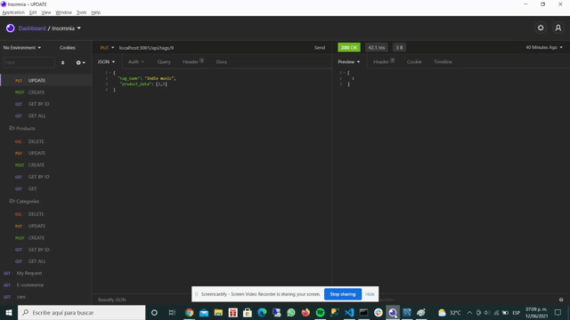

# E-COMMERCE


## Description
  
A mysql database and application backend for an e-commerce site. Built using MySQL2, Express, Sequelize and dotenv.

  
  
## Table of Contents
  
  *[Installation](#installation)
  
  *[Usage](#usage)
  
  *[Build-With](#build-with)

  *[Links](#links)

  *[Author](#author)
  
  *[Contributing](#contributing)
  
  *[Questions](#questions)

## Installation
  * Go to the following link [https://github.com/Yazmin30-bot/e-commerce](https://github.com/Yazmin30-bot/e-commerce/) and clone it 
  * Go to Git-bash and page the github's with the following code
    ```
    $ git clone https://github.com/Yazmin30-bot/e-commerce.git
    ``` 
    
  * When you first set up the project before installing any dependencies, make sure that your repo includes a package.json with the required dependencies. You can create one by running 
    ```
    npm init
  
    ``` 
  * For this project is needed to add the following dependencies to package.json file  
    ```
        "devDependencies": {
          "nodemon": "^2.0.3"
        },
        "dependencies": {
          "dotenv": "^8.2.0",
          "express": "^4.17.1",
          "install": "^0.13.0",
          "mysql2": "^2.1.0",
          "sequelize": "^5.21.7"
        }
    ``` 
    

  * To install necessary dependencies, run the following command:
    ```
    npm install
    ```
## Usage
  * Create the database using the schema.sql on MySQL Workbench
    
  
  * To seed the database from the use the  following command line

      ```
    npm run seed
    ```

  * The application will be invoked by using the following command:

    ```bash
    npm start
    ```
  * The following image demonstrates the application functionality, Also you can find the video on the links section:  
    

  * If you have and error, make sure that the following info are correct with your own data on the .env file
      ```bash
        DB_USER='user'
        DB_PW='password'
        DB_NAME='ecommerce_db'
    ``` 
    or you can use the next code and add it before to create the database on MySQL Workbench

    ```bash
    ALTER USER 'root'@'localhost' IDENTIFIED WITH mysql_native_password BY 'root';
    ```      
    and replace the following data on your .env file

    ```bash
        DB_USER='root'
        DB_PW='root'
        DB_NAME='ecommerce_db'
    ```  


## Build with 
  * [Javascript](https://www.javascript.com/) - `Javascript`
  * [NodeJs](https://nodejs.org/en/) - `NodeJs`
  * [MySQL2](https://github.com/sidorares/node-mysql2#readme/) - `MySQL`
  * [Sequelize](https://sequelize.org//) - `Sequelize`
  * [Express](http://expressjs.com/) - `Express`
  * [Dotenv](https://github.com/motdotla/dotenv#readme/) - `Dotenv`  

  


## Links
  * The Video of the deployed application.
  [https://drive.google.com/file/d/1iLEo44KguP3r5r-a2_XDnNIkNOCoxD7M/view?usp=sharing/](https://drive.google.com/file/d/1iLEo44KguP3r5r-a2_XDnNIkNOCoxD7M/view?usp=sharing/)

  * The URL of the GitHub repository.                                         [https://github.com/Yazmin30-bot/e-commerce/](https://github.com/Yazmin30-bot/e-commerce/)

## Author 
  * **`Yazmin Tinoco`**   - [Yazmin30-bot](https://github.com/Yazmin30-bot/)

## Contributing
  Pull requests are welcome. For major changes, please open an issue first to discuss what you would like to change. 


  
## Questions
  If you have any questions about the repo, open an issue or contact me directly at ytip30@gmail.com.
  You can find more of my work at [Yazmin30-bot](https://github.com/Yazmin30-bot/).  
